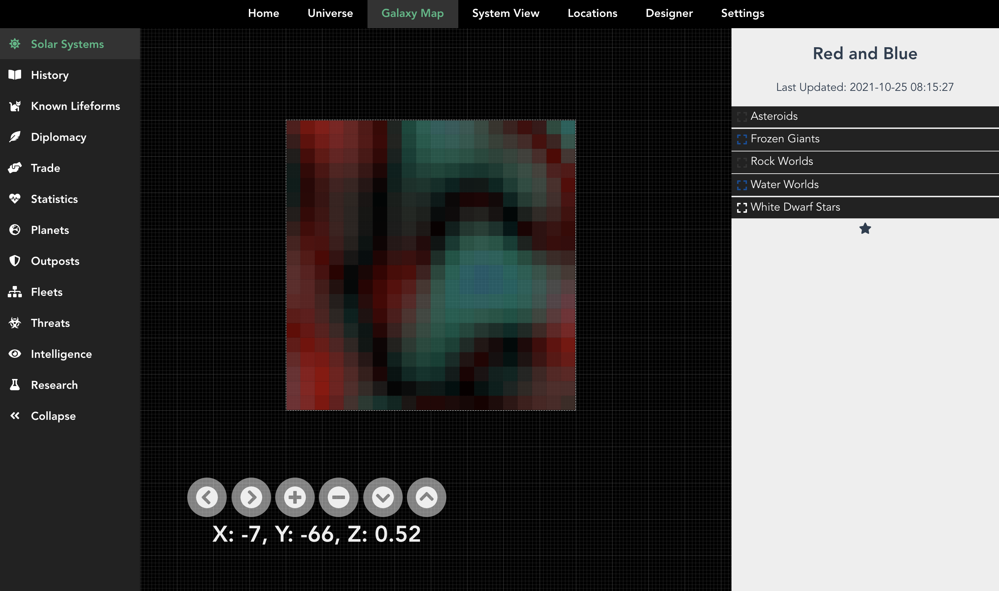
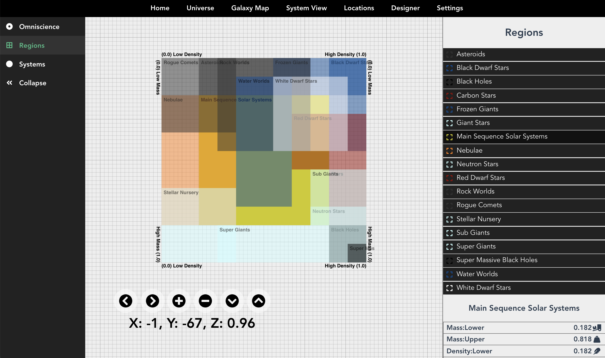
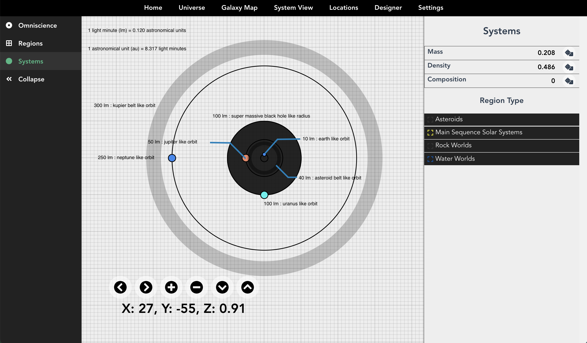

# Space - mkv25

An experiment in creating a cross-platform application using [Electron JS](https://www.electronjs.org/docs/latest/tutorial/quick-start).

This project will eventually be named "Space Infinite" once it reaches critical mass to replace my 2004-2006 project of the same name.

## Preview

## Quick Start for Local Development

Run:
- `npm install`
- `npm start`

This should open up an electron window, running the application using `mainui` hosted from a local server. You should use this when making extensive edits to the user interface - although you may need to do hard restarts to clear any local caching.

## Test Local Distribution

Run:
- `npm run start:predist`

This is an intermediary step that, that will open an electron window, running the application based on a packaged distribution of the `mainui` project, sourced from `mainui/dist`. You should use this to test the application before packaging.

## Packaging

Run: 
- `npm run make`

Produces outputs releasable versions in `out/`.

Find a compatable build based on your local platform, and launch to test.

## TODO

- Generate individual systems using region types and stellar archetypes
- Create navigable map from galaxy, down to system
- Create navigable map from system, down to stellar entity
- Create navigable map from stellar entity, down to faction entity
- Procedurally generate inaccessible areas outside of selected map
- Support harsh boundary, island boundary, and continual boundary maps
- Create default player faction
- Create NPC factions
- Create multiplay player factions
- Create basic colony
- Create basic ship
- Create gameloop - progress time based on event stream
- Create turn loop - end turn, play forward, pause
- Allow unconstrained movement within system
- Allow unconstrained movement between systems 
- Add Start, Game, and End screens

## Done

- Create omniscience section for region types
- Load region types from modpack data
- Create modpack loader
- Create navigable area viewer, with pan, and zoom controls
- Create Regions Viewer 
- Create Omniscience section
- Create procedural map generator using perlin noise generator
- Replace default image assets
- Save, and Load screens
- Introduce Font Awesome
- Add current game context to Home and Universe pages
- Introduce concept of Save and Load
- Build a debug page that can be enabled from settings
- Allow developer console to be enabled from settings page
- Tidy up the UI and CSS
- Link persistent storage model to vuex store
- Build a persistent storage model
- Add a Settings page to the router
- Implement build automation, and document commands in README
- Set up basic Electron wrapper
- Set up basic Vue application with Routing
- Build a full page interactive application
- Configure Electron to work with the file based version of the compiled Vue application